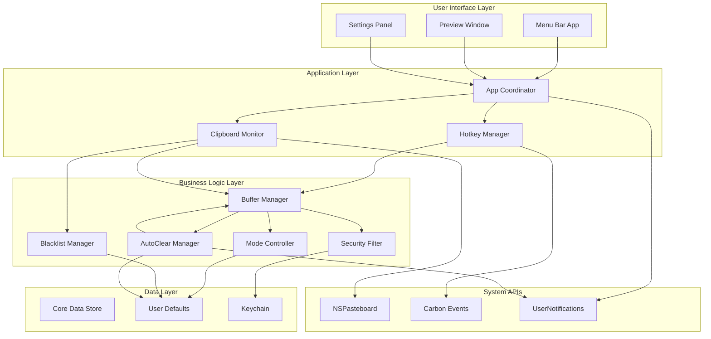
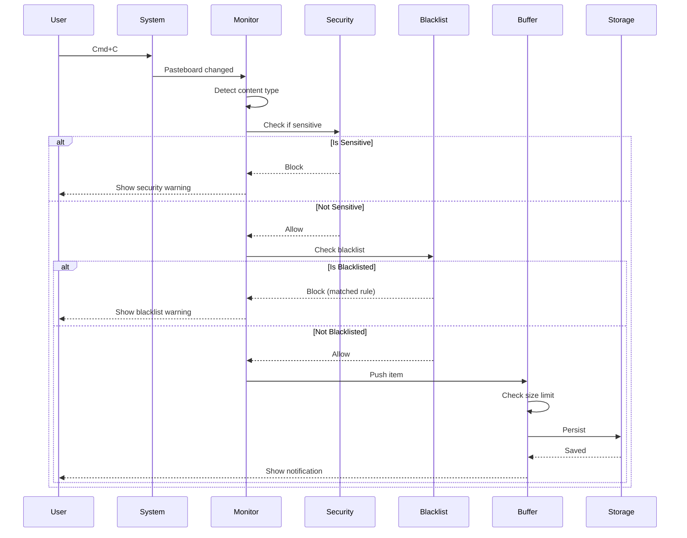
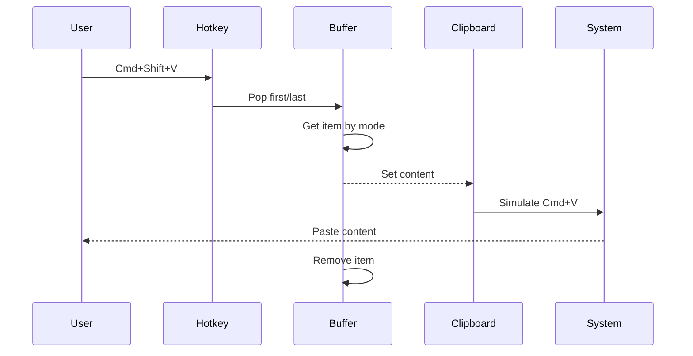

# ClipStack - Техническая архитектура

## 🏗️ Общая архитектура системы



## 📦 Модульная структура

### 1. Core Module (Ядро)

#### ClipBuffer - Основной буфер
```swift
protocol ClipBufferProtocol {
    var mode: BufferMode { get set }
    var items: [ClipItem] { get }
    var maxSize: Int { get }
    
    func push(_ item: ClipItem)
    func pop() -> ClipItem?
    func popLast() -> ClipItem?
    func peek() -> ClipItem?
    func clear()
    func remove(at index: Int)
    func toggleMode()
}

class ClipBuffer: ClipBufferProtocol {
    private var storage: [ClipItem] = []
    private(set) var mode: BufferMode = .stack
    let maxSize: Int = 100
    
    // Реализация LIFO для Stack
    func pop() -> ClipItem? {
        guard !storage.isEmpty else { return nil }
        return mode == .stack ? storage.removeLast() : storage.removeFirst()
    }
    
    // Реализация доступа к последнему элементу
    func popLast() -> ClipItem? {
        guard !storage.isEmpty else { return nil }
        return mode == .stack ? storage.removeFirst() : storage.removeLast()
    }
}
```

#### ClipItem - Модель данных
```swift
struct ClipItem: Identifiable, Codable, Equatable {
    let id: UUID
    let content: String
    let timestamp: Date
    let sourceApp: String?
    let contentType: ContentType
    
    var preview: String {
        String(content.prefix(50))
    }
    
    var formattedTimestamp: String {
        let formatter = RelativeDateTimeFormatter()
        return formatter.localizedString(for: timestamp, relativeTo: Date())
    }
    
    enum ContentType: String, Codable {
        case plainText
        case url
        case code
        case email
    }
}

enum BufferMode: String, Codable {
    case stack  // LIFO - Last In First Out
    case queue  // FIFO - First In First Out
    
    var displayName: String {
        switch self {
        case .stack: return "Stack (LIFO)"
        case .queue: return "Queue (FIFO)"
        }
    }
    
    var icon: String {
        switch self {
        case .stack: return "arrow.up.arrow.down"
        case .queue: return "arrow.right.arrow.left"
        }
    }
}
```

### 2. Clipboard Module (Работа с буфером обмена)

#### ClipboardMonitor - Мониторинг изменений
```swift
class ClipboardMonitor: ObservableObject {
    private let pasteboard = NSPasteboard.general
    private var changeCount: Int
    private var timer: Timer?
    
    @Published var lastCopiedItem: ClipItem?
    
    weak var delegate: ClipboardMonitorDelegate?
    
    init() {
        self.changeCount = pasteboard.changeCount
    }
    
    func startMonitoring() {
        timer = Timer.scheduledTimer(
            withTimeInterval: 0.5,
            repeats: true
        ) { [weak self] _ in
            self?.checkForChanges()
        }
    }
    
    private func checkForChanges() {
        guard pasteboard.changeCount != changeCount else { return }
        changeCount = pasteboard.changeCount
        
        if let string = pasteboard.string(forType: .string) {
            let item = ClipItem(
                id: UUID(),
                content: string,
                timestamp: Date(),
                sourceApp: NSWorkspace.shared.frontmostApplication?.localizedName,
                contentType: detectContentType(string)
            )
            
            delegate?.clipboardDidChange(item)
        }
    }
    
    private func detectContentType(_ content: String) -> ClipItem.ContentType {
        if content.starts(with: "http://") || content.starts(with: "https://") {
            return .url
        }
        if content.contains("@") && content.contains(".") {
            return .email
        }
        if content.contains("{") || content.contains("func") || content.contains("class") {
            return .code
        }
        return .plainText
    }
    
    func paste(_ content: String) {
        pasteboard.clearContents()
        pasteboard.setString(content, forType: .string)
        
        // Симуляция Cmd+V
        let source = CGEventSource(stateID: .hidSystemState)
        let cmdVDown = CGEvent(keyboardEventSource: source, virtualKey: 0x09, keyDown: true)
        let cmdVUp = CGEvent(keyboardEventSource: source, virtualKey: 0x09, keyDown: false)
        
        cmdVDown?.flags = .maskCommand
        cmdVUp?.flags = .maskCommand
        
        cmdVDown?.post(tap: .cghidEventTap)
        cmdVUp?.post(tap: .cghidEventTap)
    }
}

protocol ClipboardMonitorDelegate: AnyObject {
    func clipboardDidChange(_ item: ClipItem)
}
```

### 3. Hotkey Module (Горячие клавиши)

#### HotkeyManager - Управление горячими клавишами
```swift
class HotkeyManager {
    private var hotkeys: [HotkeyIdentifier: EventHotKeyRef?] = [:]
    
    enum HotkeyIdentifier: UInt32 {
        case popFirst = 1    // Cmd+Shift+V
        case popLast = 2     // Cmd+Shift+B
        case toggleMode = 3  // Cmd+Shift+M
        case showBuffer = 4  // Cmd+Shift+C
        case clearBuffer = 5 // Cmd+Shift+X
    }
    
    weak var delegate: HotkeyManagerDelegate?
    
    func registerHotkeys() {
        registerHotkey(.popFirst, keyCode: 0x09, modifiers: [.command, .shift])    // V
        registerHotkey(.popLast, keyCode: 0x0B, modifiers: [.command, .shift])     // B
        registerHotkey(.toggleMode, keyCode: 0x2E, modifiers: [.command, .shift])  // M
        registerHotkey(.showBuffer, keyCode: 0x08, modifiers: [.command, .shift])  // C
        registerHotkey(.clearBuffer, keyCode: 0x07, modifiers: [.command, .shift]) // X
    }
    
    private func registerHotkey(
        _ identifier: HotkeyIdentifier,
        keyCode: UInt32,
        modifiers: [CGEventFlags]
    ) {
        var eventType = EventTypeSpec(
            eventClass: OSType(kEventClassKeyboard),
            eventKind: UInt32(kEventHotKeyPressed)
        )
        
        var hotKeyRef: EventHotKeyRef?
        let modifierFlags = modifiers.reduce(0) { $0 | $1.rawValue }
        
        RegisterEventHotKey(
            keyCode,
            UInt32(modifierFlags),
            EventHotKeyID(signature: 0x4353, id: identifier.rawValue),
            GetApplicationEventTarget(),
            0,
            &hotKeyRef
        )
        
        hotkeys[identifier] = hotKeyRef
    }
    
    func handleHotkeyEvent(_ identifier: HotkeyIdentifier) {
        delegate?.hotkeyPressed(identifier)
    }
}

protocol HotkeyManagerDelegate: AnyObject {
    func hotkeyPressed(_ identifier: HotkeyManager.HotkeyIdentifier)
}
```

### 4. Security Module (Безопасность)

#### SecurityFilter - Фильтрация чувствительных данных
```swift
class SecurityFilter {
    private let sensitivePatterns: [SensitivePattern]
    
    enum SensitivePattern {
        case password
        case creditCard
        case apiKey
        case privateKey
        case token
        
        var regex: NSRegularExpression? {
            let pattern: String
            switch self {
            case .password:
                pattern = "(?i)(password|passwd|pwd)\\s*[:=]\\s*[\\S]+"
            case .creditCard:
                pattern = "\\b\\d{4}[\\s-]?\\d{4}[\\s-]?\\d{4}[\\s-]?\\d{4}\\b"
            case .apiKey:
                pattern = "(?i)(api[_-]?key|apikey)\\s*[:=]\\s*[\\S]+"
            case .privateKey:
                pattern = "-----BEGIN (RSA |DSA |EC )?PRIVATE KEY-----"
            case .token:
                pattern = "(?i)(token|bearer)\\s*[:=]\\s*[\\S]+"
            }
            return try? NSRegularExpression(pattern: pattern)
        }
    }
    
    init() {
        self.sensitivePatterns = [
            .password, .creditCard, .apiKey, .privateKey, .token
        ]
    }
    
    func isSensitive(_ content: String) -> Bool {
        for pattern in sensitivePatterns {
            guard let regex = pattern.regex else { continue }
            let range = NSRange(content.startIndex..., in: content)
            if regex.firstMatch(in: content, range: range) != nil {
                return true
            }
        }
        return false
    }
    
    func shouldFilter(_ item: ClipItem) -> Bool {
        return isSensitive(item.content)
    }
}
```

### 5. Blacklist Module (Чёрный список)

#### BlacklistManager - Управление чёрным списком
```swift
struct BlacklistRule: Identifiable, Codable, Equatable {
    let id: UUID
    var pattern: String
    var isEnabled: Bool
    var isCaseSensitive: Bool
    var description: String?
    let createdAt: Date
}

class BlacklistManager: ObservableObject {
    @Published private(set) var rules: [BlacklistRule] = []
    private let storage: BlacklistStorage
    
    init(storage: BlacklistStorage = UserDefaultsBlacklistStorage()) {
        self.storage = storage
        self.rules = storage.load()
    }
    
    func addRule(_ rule: BlacklistRule) {
        rules.append(rule)
        save()
    }
    
    func removeRule(id: UUID) {
        rules.removeAll { $0.id == id }
        save()
    }
    
    func isBlacklisted(_ content: String) -> (blocked: Bool, matchedRule: BlacklistRule?) {
        for rule in rules where rule.isEnabled {
            let searchContent = rule.isCaseSensitive ? content : content.lowercased()
            let searchPattern = rule.isCaseSensitive ? rule.pattern : rule.pattern.lowercased()
            
            if searchContent.contains(searchPattern) {
                return (true, rule)
            }
        }
        return (false, nil)
    }
    
    private func save() {
        storage.save(rules)
    }
}

protocol BlacklistStorage {
    func save(_ rules: [BlacklistRule])
    func load() -> [BlacklistRule]
}
```

### 6. AutoClear Module (Автоочистка)

#### AutoClearManager - Управление автоочисткой
```swift
struct AutoClearSettings: Codable {
    var isEnabled: Bool = false
    var interval: TimeInterval = 1800  // 30 минут
    var notifyBeforeClear: Bool = true
    var notificationTime: TimeInterval = 60
    var clearOnlyOldItems: Bool = false
    var itemMaxAge: TimeInterval = 3600
}

class AutoClearManager: ObservableObject {
    @Published private(set) var settings: AutoClearSettings
    @Published private(set) var timeUntilClear: TimeInterval?
    @Published private(set) var isCountingDown: Bool = false
    
    private var clearTimer: Timer?
    private var notificationTimer: Timer?
    private var countdownTimer: Timer?
    private var lastActivityTime: Date?
    
    weak var delegate: AutoClearManagerDelegate?
    
    func start() {
        guard settings.isEnabled else { return }
        resetTimer()
    }
    
    func resetTimer() {
        stop()
        guard settings.isEnabled else { return }
        
        lastActivityTime = Date()
        isCountingDown = true
        timeUntilClear = settings.interval
        
        clearTimer = Timer.scheduledTimer(
            withTimeInterval: settings.interval,
            repeats: false
        ) { [weak self] _ in
            self?.performClear()
        }
        
        if settings.notifyBeforeClear {
            let notificationDelay = settings.interval - settings.notificationTime
            if notificationDelay > 0 {
                notificationTimer = Timer.scheduledTimer(
                    withTimeInterval: notificationDelay,
                    repeats: false
                ) { [weak self] _ in
                    self?.notifyBeforeClear()
                }
            }
        }
    }
    
    func postponeClear(by interval: TimeInterval) {
        guard isCountingDown else { return }
        if let currentTime = timeUntilClear {
            timeUntilClear = currentTime + interval
            resetTimer()
        }
    }
    
    private func performClear() {
        stop()
        
        if settings.clearOnlyOldItems {
            delegate?.autoClearShouldClearOldItems(olderThan: settings.itemMaxAge)
        } else {
            delegate?.autoClearShouldClearBuffer()
        }
        
        if settings.isEnabled {
            resetTimer()
        }
    }
}

protocol AutoClearManagerDelegate: AnyObject {
    func autoClearShouldClearBuffer()
    func autoClearShouldClearOldItems(olderThan age: TimeInterval)
}
```

### 7. Storage Module (Хранилище)

#### CoreDataManager - Персистентность
```swift
class CoreDataManager {
    static let shared = CoreDataManager()
    
    lazy var persistentContainer: NSPersistentContainer = {
        let container = NSPersistentContainer(name: "ClipStack")
        container.loadPersistentStores { description, error in
            if let error = error {
                fatalError("Unable to load persistent stores: \(error)")
            }
        }
        return container
    }()
    
    var context: NSManagedObjectContext {
        persistentContainer.viewContext
    }
    
    func saveItems(_ items: [ClipItem]) {
        let context = self.context
        
        // Удаляем старые записи
        let fetchRequest: NSFetchRequest<NSFetchRequestResult> = ClipItemEntity.fetchRequest()
        let deleteRequest = NSBatchDeleteRequest(fetchRequest: fetchRequest)
        try? context.execute(deleteRequest)
        
        // Сохраняем новые
        for item in items {
            let entity = ClipItemEntity(context: context)
            entity.id = item.id
            entity.content = item.content
            entity.timestamp = item.timestamp
            entity.sourceApp = item.sourceApp
            entity.contentType = item.contentType.rawValue
        }
        
        try? context.save()
    }
    
    func loadItems() -> [ClipItem] {
        let fetchRequest: NSFetchRequest<ClipItemEntity> = ClipItemEntity.fetchRequest()
        fetchRequest.sortDescriptors = [NSSortDescriptor(key: "timestamp", ascending: false)]
        
        guard let entities = try? context.fetch(fetchRequest) else {
            return []
        }
        
        return entities.compactMap { entity in
            guard let id = entity.id,
                  let content = entity.content,
                  let timestamp = entity.timestamp,
                  let contentTypeRaw = entity.contentType,
                  let contentType = ClipItem.ContentType(rawValue: contentTypeRaw)
            else { return nil }
            
            return ClipItem(
                id: id,
                content: content,
                timestamp: timestamp,
                sourceApp: entity.sourceApp,
                contentType: contentType
            )
        }
    }
}
```

## 🔄 Потоки данных

### Поток копирования


### Поток извлечения


## 🎨 UI Architecture

### SwiftUI Views структура
```swift
// Main App
@main
struct ClipStackApp: App {
    @NSApplicationDelegateAdaptor(AppDelegate.self) var appDelegate
    
    var body: some Scene {
        Settings {
            SettingsView()
        }
    }
}

// Menu Bar
class AppDelegate: NSObject, NSApplicationDelegate {
    var statusItem: NSStatusItem?
    var popover: NSPopover?
    
    func applicationDidFinishLaunching(_ notification: Notification) {
        setupMenuBar()
        setupHotkeys()
        startClipboardMonitoring()
    }
}

// Preview Window
struct BufferPreviewView: View {
    @ObservedObject var buffer: ClipBuffer
    @State private var searchText = ""
    
    var filteredItems: [ClipItem] {
        if searchText.isEmpty {
            return buffer.items
        }
        return buffer.items.filter { $0.content.contains(searchText) }
    }
    
    var body: some View {
        VStack(spacing: 0) {
            HeaderView(mode: buffer.mode)
            SearchBar(text: $searchText)
            ItemsList(items: filteredItems)
            FooterView()
        }
        .frame(width: 400, height: 500)
    }
}
```

## 🔐 Безопасность и права доступа

### Необходимые разрешения (Info.plist)
```xml
<key>NSAppleEventsUsageDescription</key>
<string>ClipStack needs access to control keyboard events for hotkeys</string>

<key>NSSystemAdministrationUsageDescription</key>
<string>ClipStack needs access to monitor clipboard changes</string>

<key>LSUIElement</key>
<true/>
```

### Sandboxing
```xml
<key>com.apple.security.app-sandbox</key>
<true/>

<key>com.apple.security.automation.apple-events</key>
<true/>

<key>com.apple.security.files.user-selected.read-write</key>
<true/>
```

## 📊 Производительность

### Оптимизации
1. **Ленивая загрузка**: Превью элементов загружаются по требованию
2. **Батчинг**: Сохранение в Core Data пакетами
3. **Дебаунсинг**: Проверка буфера обмена с задержкой 500ms
4. **Кэширование**: Часто используемые элементы в памяти

### Метрики
- Время отклика на копирование: < 100ms
- Время извлечения элемента: < 50ms
- Использование памяти: < 50MB
- Размер на диске: < 10MB

## 🧪 Тестирование

### Unit Tests
```swift
class ClipBufferTests: XCTestCase {
    var buffer: ClipBuffer!
    
    override func setUp() {
        buffer = ClipBuffer()
    }
    
    func testStackMode() {
        buffer.mode = .stack
        let item1 = createTestItem("A")
        let item2 = createTestItem("B")
        
        buffer.push(item1)
        buffer.push(item2)
        
        XCTAssertEqual(buffer.pop()?.content, "B")
        XCTAssertEqual(buffer.pop()?.content, "A")
    }
    
    func testQueueMode() {
        buffer.mode = .queue
        let item1 = createTestItem("A")
        let item2 = createTestItem("B")
        
        buffer.push(item1)
        buffer.push(item2)
        
        XCTAssertEqual(buffer.pop()?.content, "A")
        XCTAssertEqual(buffer.pop()?.content, "B")
    }
}
```

## 🚀 Deployment

### Build Configuration
```swift
// Debug
#if DEBUG
let isDebugMode = true
let logLevel = LogLevel.verbose
#else
let isDebugMode = false
let logLevel = LogLevel.error
#endif
```

### Distribution
- **Notarization**: Обязательна для macOS 10.15+
- **Code Signing**: Developer ID Application
- **Distribution**: Mac App Store + Direct Download

---

**Версия архитектуры**: 1.0
**Последнее обновление**: 2026-01-29
**Статус**: Ready for Implementation