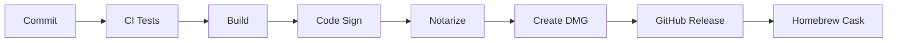

# ClipStack - План разработки

## 🎯 Обзор проекта

**Название**: ClipStack  
**Платформа**: macOS 12.0+  
**Язык**: Swift 5.9+  
**Фреймворк**: SwiftUI + AppKit  
**Срок разработки MVP**: 6-8 недель  

## 📋 Этапы разработки

### Этап 1: Подготовка и настройка (Неделя 1)

#### 1.1 Настройка проекта
- [ ] Создать Xcode проект
- [ ] Настроить Git репозиторий
- [ ] Создать структуру папок
- [ ] Настроить `.gitignore`
- [ ] Создать базовый `README.md`

#### 1.2 Настройка зависимостей
- [ ] Настроить Swift Package Manager
- [ ] Добавить необходимые фреймворки
- [ ] Настроить Code Signing
- [ ] Создать схемы сборки (Debug/Release)

#### 1.3 Настройка CI/CD
- [ ] Настроить GitHub Actions
- [ ] Создать workflow для тестов
- [ ] Настроить автоматическую сборку
- [ ] Настроить линтеры (SwiftLint)

**Результат**: Готовая инфраструктура для разработки

---

### Этап 2: Core модуль (Неделя 2-3)

#### 2.1 Модели данных
```swift
// Приоритет: Высокий
// Время: 2 дня
```
- [ ] Создать [`ClipItem`](clipstack/Sources/Models/ClipItem.swift) модель
- [ ] Создать [`BufferMode`](clipstack/Sources/Models/BufferMode.swift) enum
- [ ] Добавить [`ContentType`](clipstack/Sources/Models/ContentType.swift) enum
- [ ] Написать unit тесты для моделей

#### 2.2 Buffer Manager
```swift
// Приоритет: Критический
// Время: 3 дня
```
- [ ] Создать [`ClipBuffer`](clipstack/Sources/Core/ClipBuffer.swift) класс
- [ ] Реализовать Stack режим (LIFO)
- [ ] Реализовать Queue режим (FIFO)
- [ ] Добавить ограничение размера (100 элементов)
- [ ] Реализовать [`pop()`](clipstack/Sources/Core/ClipBuffer.swift:45), [`popLast()`](clipstack/Sources/Core/ClipBuffer.swift:52), [`peek()`](clipstack/Sources/Core/ClipBuffer.swift:59)
- [ ] Написать comprehensive unit тесты

#### 2.3 Clipboard Monitor
```swift
// Приоритет: Критический
// Время: 3 дня
```
- [ ] Создать [`ClipboardMonitor`](clipstack/Sources/Clipboard/ClipboardMonitor.swift) класс
- [ ] Реализовать мониторинг `NSPasteboard`
- [ ] Добавить определение типа контента
- [ ] Реализовать дебаунсинг (500ms)
- [ ] Добавить определение source app
- [ ] Написать unit тесты

**Результат**: Работающее ядро приложения с тестами

---

### Этап 3: Hotkey система (Неделя 3-4)

#### 3.1 Hotkey Manager
```swift
// Приоритет: Высокий
// Время: 4 дня
```
- [ ] Создать [`HotkeyManager`](clipstack/Sources/Hotkeys/HotkeyManager.swift) класс
- [ ] Интегрировать Carbon Events API
- [ ] Реализовать регистрацию горячих клавиш:
  - [ ] `Cmd+Shift+V` - извлечь первый
  - [ ] `Cmd+Shift+B` - извлечь последний
  - [ ] `Cmd+Shift+M` - переключить режим
  - [ ] `Cmd+Shift+C` - показать буфер
  - [ ] `Cmd+Shift+X` - очистить буфер
- [ ] Добавить обработку конфликтов
- [ ] Реализовать симуляцию `Cmd+V`
- [ ] Написать integration тесты

#### 3.2 Настройка горячих клавиш
```swift
// Приоритет: Средний
// Время: 2 дня
```
- [ ] Создать UI для настройки
- [ ] Добавить валидацию комбинаций
- [ ] Сохранение в UserDefaults
- [ ] Восстановление дефолтных значений

**Результат**: Полностью работающая система горячих клавиш

---

### Этап 4: Security и Blacklist модули (Неделя 4)

#### 4.1 Security Filter
```swift
// Приоритет: Высокий
// Время: 2 дня
```
- [ ] Создать [`SecurityFilter`](clipstack/Sources/Security/SecurityFilter.swift) класс
- [ ] Добавить regex паттерны для:
  - [ ] Паролей
  - [ ] Кредитных карт
  - [ ] API ключей
  - [ ] Private keys
  - [ ] Токенов
- [ ] Реализовать [`isSensitive()`](clipstack/Sources/Security/SecurityFilter.swift:45) метод
- [ ] Написать unit тесты с примерами

#### 4.2 Blacklist Manager
```swift
// Приоритет: Высокий
// Время: 3 дня
```
- [ ] Создать [`BlacklistRule`](clipstack/Sources/Blacklist/BlacklistRule.swift) модель
- [ ] Создать [`BlacklistManager`](clipstack/Sources/Blacklist/BlacklistManager.swift) класс
- [ ] Реализовать [`isBlacklisted()`](clipstack/Sources/Blacklist/BlacklistManager.swift:45) метод
- [ ] Добавить поддержку case sensitivity
- [ ] Создать [`BlacklistStorage`](clipstack/Sources/Blacklist/BlacklistStorage.swift) протокол
- [ ] Реализовать UserDefaults storage
- [ ] Написать comprehensive unit тесты

#### 4.3 Уведомления о блокировке
```swift
// Приоритет: Средний
// Время: 1 день
```
- [ ] Добавить UserNotifications
- [ ] Создать уведомление о security блокировке
- [ ] Создать уведомление о blacklist блокировке
- [ ] Добавить настройку уведомлений

**Результат**: Защита от копирования чувствительных данных и настраиваемая фильтрация

---

### Этап 5: Storage модуль (Неделя 5)

#### 5.1 Core Data Setup
```swift
// Приоритет: Высокий
// Время: 2 дня
```
- [ ] Создать Core Data модель
- [ ] Создать [`ClipItemEntity`](clipstack/Sources/Storage/ClipItemEntity.swift)
- [ ] Настроить [`NSPersistentContainer`](clipstack/Sources/Storage/CoreDataManager.swift:15)
- [ ] Добавить миграции

#### 5.2 Data Manager
```swift
// Приоритет: Высокий
// Время: 3 дня
```
- [ ] Создать [`CoreDataManager`](clipstack/Sources/Storage/CoreDataManager.swift) singleton
- [ ] Реализовать [`saveItems()`](clipstack/Sources/Storage/CoreDataManager.swift:45)
- [ ] Реализовать [`loadItems()`](clipstack/Sources/Storage/CoreDataManager.swift:65)
- [ ] Добавить batch операции
- [ ] Реализовать автосохранение
- [ ] Написать integration тесты

#### 5.3 Settings Storage
```swift
// Приоритет: Средний
// Время: 1 день
```
- [ ] Создать [`SettingsManager`](clipstack/Sources/Storage/SettingsManager.swift)
- [ ] Сохранение режима буфера
- [ ] Сохранение горячих клавиш
- [ ] Сохранение настроек UI

**Результат**: Персистентное хранилище данных

---

### Этап 6: UI Layer (Неделя 5-6)

#### 6.1 Menu Bar App
```swift
// Приоритет: Критический
// Время: 3 дня
```
- [ ] Создать [`AppDelegate`](clipstack/Sources/App/AppDelegate.swift)
- [ ] Настроить `NSStatusItem`
- [ ] Создать menu bar иконку
- [ ] Добавить индикатор количества элементов
- [ ] Создать контекстное меню
- [ ] Добавить превью последних элементов

#### 6.2 Preview Window
```swift
// Приоритет: Высокий
// Время: 4 дня
```
- [ ] Создать [`BufferPreviewView`](clipstack/Sources/Views/BufferPreviewView.swift)
- [ ] Добавить список элементов
- [ ] Реализовать поиск
- [ ] Добавить удаление элементов
- [ ] Реализовать копирование обратно
- [ ] Добавить экспорт в файл
- [ ] Стилизация и анимации

#### 6.3 Settings Window
```swift
// Приоритет: Средний
// Время: 3 дня
```
- [ ] Создать [`SettingsView`](clipstack/Sources/Views/SettingsView.swift)
- [ ] Вкладка "General"
- [ ] Вкладка "Hotkeys"
- [ ] Вкладка "Security"
- [ ] Вкладка "Blacklist":
  - [ ] Список правил
  - [ ] Добавление/удаление правил
  - [ ] Включение/выключение правил
  - [ ] Настройка case sensitivity
  - [ ] Пресеты правил
- [ ] Вкладка "About"

**Результат**: Полноценный пользовательский интерфейс

---

### Этап 7: Интеграция и тестирование (Неделя 7)

#### 7.1 Интеграция модулей
```swift
// Приоритет: Критический
// Время: 3 дня
```
- [ ] Связать ClipboardMonitor с ClipBuffer
- [ ] Связать HotkeyManager с ClipBuffer
- [ ] Связать SecurityFilter с ClipboardMonitor
- [ ] Связать BlacklistManager с ClipboardMonitor
- [ ] Связать CoreDataManager с ClipBuffer
- [ ] Добавить App Coordinator

#### 7.2 End-to-End тестирование
```swift
// Приоритет: Высокий
// Время: 2 дня
```
- [ ] Тест полного цикла копирования
- [ ] Тест извлечения в Stack режиме
- [ ] Тест извлечения в Queue режиме
- [ ] Тест переключения режимов
- [ ] Тест фильтрации чувствительных данных
- [ ] Тест чёрного списка
- [ ] Тест персистентности

#### 7.3 Performance тестирование
```swift
// Приоритет: Средний
// Время: 1 день
```
- [ ] Тест производительности буфера
- [ ] Тест использования памяти
- [ ] Тест времени отклика
- [ ] Оптимизация узких мест

**Результат**: Стабильное и протестированное приложение

---

### Этап 8: Полировка и релиз (Неделя 8)

#### 8.1 UI/UX полировка
```swift
// Приоритет: Средний
// Время: 2 дня
```
- [ ] Добавить анимации
- [ ] Улучшить иконки
- [ ] Добавить звуковые эффекты
- [ ] Оптимизировать layout
- [ ] Добавить dark mode поддержку

#### 8.2 Документация
```markdown
// Приоритет: Высокий
// Время: 2 дня
```
- [ ] Обновить README.md
- [ ] Создать CONTRIBUTING.md
- [ ] Создать CHANGELOG.md
- [ ] Добавить inline документацию
- [ ] Создать user guide

#### 8.3 Подготовка к релизу
```bash
// Приоритет: Критический
// Время: 2 дня
```
- [ ] Code signing
- [ ] Notarization для macOS
- [ ] Создать DMG installer
- [ ] Подготовить App Store версию
- [ ] Создать GitHub Release
- [ ] Написать release notes

**Результат**: Готовое к релизу приложение

---

## 🗂️ Структура проекта

```
ClipStack/
├── ClipStack.xcodeproj
├── Sources/
│   ├── App/
│   │   ├── AppDelegate.swift
│   │   ├── AppCoordinator.swift
│   │   └── ClipStackApp.swift
│   ├── Models/
│   │   ├── ClipItem.swift
│   │   ├── BufferMode.swift
│   │   └── ContentType.swift
│   ├── Core/
│   │   ├── ClipBuffer.swift
│   │   └── ClipBufferProtocol.swift
│   ├── Clipboard/
│   │   ├── ClipboardMonitor.swift
│   │   └── ClipboardMonitorDelegate.swift
│   ├── Hotkeys/
│   │   ├── HotkeyManager.swift
│   │   └── HotkeyManagerDelegate.swift
│   ├── Security/
│   │   ├── SecurityFilter.swift
│   │   └── SensitivePattern.swift
│   ├── Storage/
│   │   ├── CoreDataManager.swift
│   │   ├── SettingsManager.swift
│   │   └── ClipStack.xcdatamodeld
│   ├── Views/
│   │   ├── BufferPreviewView.swift
│   │   ├── SettingsView.swift
│   │   ├── MenuBarView.swift
│   │   └── Components/
│   │       ├── SearchBar.swift
│   │       ├── ItemRow.swift
│   │       └── ModeToggle.swift
│   └── Utils/
│       ├── Extensions/
│       ├── Constants.swift
│       └── Logger.swift
├── Tests/
│   ├── UnitTests/
│   │   ├── ClipBufferTests.swift
│   │   ├── SecurityFilterTests.swift
│   │   └── ...
│   └── IntegrationTests/
│       ├── ClipboardIntegrationTests.swift
│       └── ...
├── Resources/
│   ├── Assets.xcassets
│   ├── Info.plist
│   └── Localizable.strings
├── Docs/
│   ├── PROJECT_CONCEPT.md
│   ├── ARCHITECTURE.md
│   └── API.md
└── README.md
```

## 🧪 Стратегия тестирования

### Unit Tests (Покрытие: 80%+)
- Все модели данных
- ClipBuffer логика
- SecurityFilter паттерны
- Утилиты и расширения

### Integration Tests (Покрытие: 60%+)
- Clipboard monitoring
- Hotkey handling
- Data persistence
- Mode switching

### UI Tests (Покрытие: 40%+)
- Menu bar interactions
- Preview window
- Settings panel

### Manual Testing
- Полный user flow
- Edge cases
- Performance под нагрузкой

## 📊 Метрики качества

### Code Quality
- SwiftLint: 0 warnings
- Code coverage: > 75%
- Cyclomatic complexity: < 10
- Documentation: > 80%

### Performance
- Время отклика: < 100ms
- Использование памяти: < 50MB
- Размер приложения: < 10MB
- CPU usage: < 5% idle

### User Experience
- Время до первого использования: < 2 минуты
- Crash rate: < 0.1%
- User satisfaction: > 4.5/5

## 🚀 Deployment Pipeline



### Релизный процесс
1. Создать release branch
2. Обновить версию в проекте
3. Обновить CHANGELOG.md
4. Запустить все тесты
5. Создать signed build
6. Notarize через Apple
7. Создать DMG installer
8. Создать GitHub Release
9. Обновить Homebrew cask
10. Анонсировать релиз

## 📅 Timeline

| Неделя | Этап | Статус |
|--------|------|--------|
| 1 | Подготовка и настройка | 🔲 Pending |
| 2-3 | Core модуль | 🔲 Pending |
| 3-4 | Hotkey система | 🔲 Pending |
| 4 | Security модуль | 🔲 Pending |
| 5 | Storage модуль | 🔲 Pending |
| 5-6 | UI Layer | 🔲 Pending |
| 7 | Интеграция и тестирование | 🔲 Pending |
| 8 | Полировка и релиз | 🔲 Pending |

## 🎯 Definition of Done

Для каждой задачи:
- ✅ Код написан и работает
- ✅ Unit тесты написаны и проходят
- ✅ Code review пройден
- ✅ Документация обновлена
- ✅ Нет SwiftLint warnings
- ✅ Протестировано вручную

Для MVP релиза:
- ✅ Все критические функции работают
- ✅ Code coverage > 75%
- ✅ Нет известных критических багов
- ✅ Документация полная
- ✅ Приложение notarized
- ✅ DMG installer создан

## 🔄 Итеративная разработка

После MVP (v1.0) планируются следующие итерации:

### v1.1 (4 недели)
- Поиск по содержимому
- Настройка горячих клавиш
- Экспорт/импорт
- Статистика

### v1.2 (4 недели)
- Форматированный текст
- История с поиском
- Умные подсказки

### v2.0 (8 недель)
- Поддержка изображений
- Синхронизация
- Плагины

## 📝 Заметки

- Приоритет на стабильность и производительность
- Минималистичный UI - не перегружать функциями
- Фокус на приватности - никаких аналитик без согласия
- Open source - прозрачность разработки

---

**Версия плана**: 1.0  
**Дата создания**: 2026-01-29  
**Статус**: Ready to Start  
**Ответственный**: Development Team