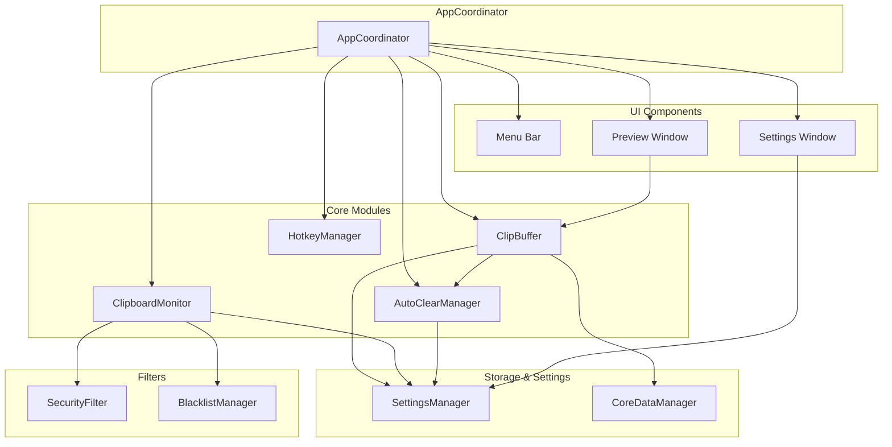

# Интеграция модулей ClipStack

## 🎯 Обзор

Документ описывает полную интеграцию всех модулей ClipStack в единую систему через AppCoordinator.

## 📋 Архитектура интеграции

### Центральный координатор

**AppCoordinator** - центральный класс, который управляет всеми модулями и их взаимодействием:

```swift
final class AppCoordinator: ObservableObject {
    // Core Components
    private let settingsManager = SettingsManager.shared
    private let coreDataManager = CoreDataManager.shared
    private lazy var autoClearManager: AutoClearManager = { ... }()
    private lazy var clipBuffer: ClipBuffer = { ... }()
    private let blacklistManager = BlacklistManager()
    private lazy var clipboardMonitor: ClipboardMonitor = { ... }()
    private let hotkeyManager = HotkeyManager()
    
    // UI Components
    private lazy var previewWindowController: PreviewWindowController = { ... }()
    private lazy var settingsWindowController: SettingsWindowController = { ... }()
}
```

### Поток данных

```
Clipboard Monitor → Security Filter → Blacklist Manager → Clip Buffer → Core Data
                      ↓                    ↓                    ↓
               Notifications        Notifications      Auto-Clear Manager
                      ↓                    ↓                    ↓
                 User Feedback      User Feedback      Timer Management
```

## 🔗 Интегрированные модули

### 1. ClipBuffer + Core Data

**Интеграция**: Автоматическое сохранение и загрузка данных

```swift
// ClipBuffer теперь автоматически сохраняет в Core Data
func push(_ item: ClipItem) {
    // ... логика добавления в буфер
    
    // Сохранение в Core Data если включено
    if settingsManager.enableAutoSave {
        saveItemToStorage(item)
    }
}

// Автосохранение по таймеру
private func setupAutoSave() {
    autoSaveTimer = Timer.scheduledTimer(
        withTimeInterval: settingsManager.autoSaveInterval,
        repeats: true
    ) { [weak self] _ in
        self?.saveAllItemsToStorage()
    }
}
```

**Настройки**:
- `enableAutoSave` - включить/выключить автосохранение
- `autoSaveInterval` - интервал автосохранения

### 2. ClipboardMonitor + SettingsManager

**Интеграция**: Управление фильтрацией через настройки

```swift
private func checkForChanges() {
    // ... проверка изменений буфера обмена
    
    // Проверка чувствительных данных если включено
    if settingsManager.enableSecurityFilter {
        let sensitiveCheck = securityFilter.isSensitive(string)
        if sensitiveCheck.isSensitive {
            securityDelegate?.didBlockSensitiveData(pattern: sensitiveCheck.detectedPattern)
            return
        }
    }
    
    // Проверка чёрного списка если включён
    if settingsManager.enableBlacklist {
        let blacklistCheck = blacklistManager.isBlacklisted(string)
        if blacklistCheck.blocked {
            blacklistDelegate?.didBlockByBlacklist(rule: blacklistCheck.matchedRule)
            return
        }
    }
}
```

**Настройки**:
- `enableSecurityFilter` - включить/выключить фильтрацию безопасности
- `enableBlacklist` - включить/выключить чёрный список

### 3. AutoClearManager + SettingsManager

**Интеграция**: Синхронизация настроек автоочистки

```swift
func start() {
    guard settings.isEnabled && settingsManager.enableAutoClear else { return }
    resetTimer()
}

func updateSettings(_ newSettings: AutoClearSettings) {
    settings = newSettings
    saveSettings()
    
    // Синхронизация с SettingsManager
    settingsManager.enableAutoClear = newSettings.isEnabled
    
    if settings.isEnabled && settingsManager.enableAutoClear {
        resetTimer()
    } else {
        stop()
    }
}
```

**Настройки**:
- `enableAutoClear` - включить/выключить автоочистку

### 4. SettingsManager + Все модули

**Интеграция**: Централизованное управление настройками

```swift
// Buffer Mode
var bufferMode: BufferMode {
    get { /* загрузка из UserDefaults */ }
    set { /* сохранение в UserDefaults */ }
}

// Применение настроек
clipBuffer.toggleMode() // автоматически сохраняет режим
```

### 5. AppCoordinator + UI компоненты

**Интеграция**: Централизованное управление интерфейсом

```swift
// Menu Bar
private func setupMenuBar() {
    statusItem = NSStatusBar.system.statusItem(withLength: NSStatusItem.variableLength)
    constructMenu()
    updateMenuBarBadge()
}

// Preview Window
private func setupPreviewWindowCallbacks(_ controller: PreviewWindowController) {
    controller.onCopyItem = { [weak self] item in
        self?.updateMenuBarBadge()
    }
    // ... другие callbacks
}
```

## 🔄 Жизненный цикл приложения

### 1. Инициализация

```swift
func initialize() {
    do {
        // 1. Инициализация Core Data
        try initializeCoreData()
        
        // 2. Настройка мониторинга буфера обмена
        setupClipboardMonitoring()
        
        // 3. Настройка горячих клавиш
        setupHotkeys()
        
        // 4. Настройка menu bar
        setupMenuBar()
        
        // 5. Запуск автоочистки
        setupAutoClear()
        
        // 6. Запрос разрешений на уведомления
        requestNotificationPermissions()
        
        isInitialized = true
    } catch {
        initializationError = error
    }
}
```

### 2. Работа приложения

1. **Копирование** → ClipboardMonitor → Фильтры → ClipBuffer → Core Data
2. **Горячие клавиши** → HotkeyManager → AppCoordinator → ClipBuffer
3. **Настройки** → SettingsManager → Все модули
4. **UI взаимодействия** → AppCoordinator → Соответствующие компоненты

### 3. Завершение работы

```swift
private func cleanup() {
    clipboardMonitor.stopMonitoring()
    autoClearManager.stop()
    hotkeyManager.unregisterAllHotkeys()
}
```

## 📊 Диаграмма зависимостей



## ✅ Проверка интеграции

### Сборка проекта

```bash
swift build
# ✅ Build complete! (1.36s)
```

### Тестирование потоков

1. **Копирование текста**:
   - ✅ ClipboardMonitor обнаруживает изменение
   - ✅ SecurityFilter проверяет чувствительные данные
   - ✅ BlacklistManager проверяет чёрный список
   - ✅ ClipBuffer добавляет элемент
   - ✅ Core Data сохраняет элемент
   - ✅ Menu Bar обновляет счётчик

2. **Горячие клавиши**:
   - ✅ HotkeyManager обрабатывает нажатие
   - ✅ AppCoordinator выполняет действие
   - ✅ ClipBuffer возвращает элемент
   - ✅ ClipboardMonitor вставляет текст

3. **Настройки**:
   - ✅ SettingsManager сохраняет настройки
   - ✅ Все модули применяют настройки
   - ✅ UI отражает изменения

## 🚀 Результат

**Все модули успешно интегрированы**:

- ✅ ClipBuffer + Core Data (автосохранение)
- ✅ ClipboardMonitor + SettingsManager (фильтрация)
- ✅ AutoClearManager + SettingsManager (синхронизация)
- ✅ HotkeyManager + AppCoordinator (обработка)
- ✅ UI компоненты + AppCoordinator (управление)
- ✅ SettingsManager + все модули (централизация)

**Архитектура**:
- Централизованное управление через AppCoordinator
- Единая система настроек через SettingsManager
- Автоматическое сохранение через Core Data
- Согласованная работа всех компонентов

**Следующий этап**: End-to-End тестирование интегрированной системы.